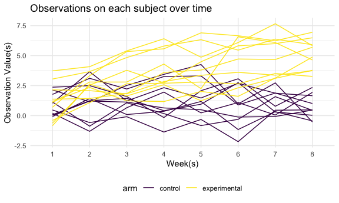

p8105 HW 5
================
Meiju Chen
11/18/2020

### Problem 1

###### The Washington Post has gathered data on homicides in 50 large U.S. cities. Describe the raw data and run ‘prop.test’ for each of the cities in the dataset. Create a plot that shows the estimates and CIs for each city.

Read in the data.

``` r
homicide_df = 
  read_csv("homicide_data/homicide-data.csv") %>% 
  mutate(
    city_state = str_c(city, state, sep = "_"),
    resolved = case_when(
      disposition == "Closed without arrest" ~ "unsolved",
      disposition == "Open/No arrest"        ~ "unsolved",
      disposition == "Closed by arrest"      ~ "solved",
    )
  ) %>% 
  select(city_state, resolved) %>% 
  filter(city_state != "Tulsa_AL")
```

    ## Parsed with column specification:
    ## cols(
    ##   uid = col_character(),
    ##   reported_date = col_double(),
    ##   victim_last = col_character(),
    ##   victim_first = col_character(),
    ##   victim_race = col_character(),
    ##   victim_age = col_character(),
    ##   victim_sex = col_character(),
    ##   city = col_character(),
    ##   state = col_character(),
    ##   lat = col_double(),
    ##   lon = col_double(),
    ##   disposition = col_character()
    ## )

Let’s look at this a bit

``` r
aggregate_df = 
  homicide_df %>% 
  group_by(city_state) %>% 
  summarize(
    hom_total = n(),
    hom_unsolved = sum(resolved == "unsolved")
  )
```

    ## `summarise()` ungrouping output (override with `.groups` argument)

Can I do a prop test for a single city?

``` r
prop.test(
  aggregate_df %>% filter(city_state == "Baltimore_MD") %>% pull(hom_unsolved), 
  aggregate_df %>% filter(city_state == "Baltimore_MD") %>% pull(hom_total)) %>% 
  broom::tidy()
```

    ## # A tibble: 1 x 8
    ##   estimate statistic  p.value parameter conf.low conf.high method    alternative
    ##      <dbl>     <dbl>    <dbl>     <int>    <dbl>     <dbl> <chr>     <chr>      
    ## 1    0.646      239. 6.46e-54         1    0.628     0.663 1-sample… two.sided

Try to iterate ……..

``` r
results_df = 
  aggregate_df %>% 
  mutate(
    prop_tests = map2(.x = hom_unsolved, .y = hom_total, ~prop.test(x = .x, n = .y)),
    tidy_tests = map(.x = prop_tests, ~broom::tidy(.x))
  ) %>% 
  select(-prop_tests) %>% 
  unnest(tidy_tests) %>% 
  select(city_state, estimate, conf.low, conf.high)
```

Make a plot

``` r
results_df %>% 
  mutate(city_state = fct_reorder(city_state, estimate)) %>% 
  ggplot(aes(x = city_state, y = estimate)) +
  geom_point() + 
  geom_errorbar(aes(ymin = conf.low, ymax = conf.high)) + 
  theme(axis.text.x = element_text(angle = 90, vjust = 0.5, hjust = 1))
```


-----

### Problem 2

###### Create a tidy dataframe containing data from all participants, make a spaghetti plot showing observations on each subject over time, and comment on differences between groups.

Import and tidy the dataset

``` r
lda_df = 
  tibble(
  path = list.files('lda_data')) %>% 
  mutate(path = str_c('lda_data/',path),
         data = purrr::map(.x = path, ~read.csv(.x))) %>% 
  unnest(data) %>% 
  separate(
    path, into = c('data', 'info'),sep = '/'
  ) %>% 
  separate(
    info, into = c('information', 'csv'), sep = '.csv'
  ) %>% 
  select(-data, -csv) %>% 
  separate(
    information, into = c('arm', 'id'), sep = '_'
  ) %>% 
  mutate(
    arm = case_when(
      arm == "con" ~ "control",
      arm == "exp" ~ "experimental")) %>% 
  pivot_longer(
    week_1:week_8,
    names_to = 'week',
    names_prefix = 'week_',
    values_to = 'observation')
```

Make a spaghetti plot.

``` r
lda_df %>% 
  ggplot(
  aes(x = week, y = observation, group = interaction(id, arm)))+
  geom_line(aes(color = arm))+ 
  labs(
    title = 'Observations on each subject over time', 
    x = "Week(s)",
    y = "Observation Value(s)")
```



  - According to the spaghetti plot above, we can see that two arms of
    subjects have similar initial observations. However, in the
    following weeks, control values are more stable than experimental
    ones, and the observation values of experimental arm are generally
    higher than those of control arm.

-----

### Problem 3

###### Conduct a simulation to explore power in a one-sample t-test.

Create a function to generate random samples and conduct t tests.

``` r
set.seed(12345)
sim_1 = function(samp_size, mu = 0, sigma = 5){
  
  sim_data = 
    tibble(
      x = rnorm(n = samp_size, mean = mu, sd = sigma)
   )
  
  sim_data %>% 
    t.test(mu = 0, conf.level = 0.95) %>% 
    broom::tidy() %>% 
    select(estimate, p.value)
  
}  
```

Generate 5000 datasets from the model: x ∼ Normal\[mu,sigma\]

``` r
sim_5000 =
  rerun(5000, sim_1(samp_size = 30)) %>% 
  bind_rows()

sim_5000
```

    ## # A tibble: 5,000 x 2
    ##    estimate p.value
    ##       <dbl>   <dbl>
    ##  1   0.394   0.649 
    ##  2   1.56    0.195 
    ##  3   2.18    0.0363
    ##  4   0.126   0.895 
    ##  5  -0.278   0.806 
    ##  6   0.0257  0.978 
    ##  7   0.686   0.341 
    ##  8   0.280   0.765 
    ##  9   0.0198  0.981 
    ## 10  -0.919   0.269 
    ## # … with 4,990 more rows

Repeat the above for mu={1,2,3,4,5,6}

``` r
sim_5000_2 =
  tibble(
    mu = c(0,1,2,3,4,5,6)
  ) %>% 
  mutate(
    output_lists = map(.x = mu, ~ rerun(5000, sim_1(30, mu = .x))),
    estimate_df = map(output_lists, bind_rows)
  ) %>% 
  select(-output_lists) %>% 
  unnest(estimate_df)

sim_5000_2
```

    ## # A tibble: 35,000 x 3
    ##       mu estimate p.value
    ##    <dbl>    <dbl>   <dbl>
    ##  1     0  -1.91    0.0245
    ##  2     0   0.514   0.624 
    ##  3     0   0.509   0.624 
    ##  4     0  -0.198   0.813 
    ##  5     0   1.01    0.228 
    ##  6     0   0.0546  0.938 
    ##  7     0  -1.92    0.0170
    ##  8     0  -1.26    0.105 
    ##  9     0  -0.118   0.892 
    ## 10     0  -0.528   0.596 
    ## # … with 34,990 more rows

Make a plot.

``` r
results_df =
sim_5000_2 %>% 
  group_by(mu) %>% 
  mutate(
    result = case_when(
      p.value < 0.05 ~ "reject",
      p.value > 0.05 ~"fail to reject"
      )
    )
    
power_plot = results_df %>% 
  group_by(mu) %>% 
  summarise(
    sum = sum(p.value < 0.05),
    count = n(),
    rej_proportion = sum/count) %>% 
  ggplot(aes(x = mu, y = rej_proportion)) + 
  geom_point() +
  geom_line() +
  labs(
    title = "ASSOCIATION BETWEEN THE EFFECT SIZE & POWER",
    x = "True Mean",
    y = "Power (Proportion of times the null was rejected)"
  ) + 
  theme(plot.title = element_text(hjust = 0.5))
```

    ## `summarise()` ungrouping output (override with `.groups` argument)

``` r
power_plot
```


  - According to the plot above, we can see that as the effect size(true
    mean) increases, the power(proportion of times the null hypothesis
    was rejected) increases. For true mean equals to 0, the power of the
    test is expected to be around 0.05. As the true mean increases, it
    is less likely that the mean of the randomized samples is equal to
    0, and it is more likely that the null hypothesis is rejected; in
    other words, the power of the test is getting larger.

Make a plot for all samples.

``` r
total_plot =
  results_df %>% 
  group_by(mu) %>%
  summarize(
    avg_mu = mean(estimate)
  ) %>% 
  ggplot(aes(x = mu, y = avg_mu)) + 
  geom_point() +
  geom_line() +
  labs(
    title = "TOTAL SAMPLES",
    x = "True Mean",
    y = "Average Estimate of Mean"
  ) + 
  theme(plot.title = element_text(hjust = 0.5))
```

    ## `summarise()` ungrouping output (override with `.groups` argument)

``` r
total_plot
```


Make a plot for the rejected samples.

``` r
rej_plot =
  results_df %>% 
  group_by(mu) %>%
  filter(result == "reject") %>% 
  summarise(
    avg_mu = mean(estimate)
  ) %>% 
  ggplot(aes(x = mu, y = avg_mu)) + 
  geom_point() +
  geom_line() +
  labs(
    title = "REJECTED SAMPLES",
    x = "True Mean",
    y = "Average Estimate of Mean"
  ) + 
  theme(plot.title = element_text(hjust = 0.5))
```

    ## `summarise()` ungrouping output (override with `.groups` argument)

``` r
rej_plot
```


Add the plots together.

``` r
total_plot + rej_plot
```


  - The plot with all samples:
    
    The true mean is approximately equal to the average estimate.

  - The plot with rejected samples:
    
    The average estimate only approximates the true mean when the effect
    size is between 4 and 6.

From the plots above, we can see that when effect size is large, the
average estimate is a good approximation of the true value. However,
when effect size is small (between 0 and 3), the average estimate is not
a good approximate for the true mean. Thus, when the effect size is
small, it is possible that the average estimate would overestimate the
true mean.
